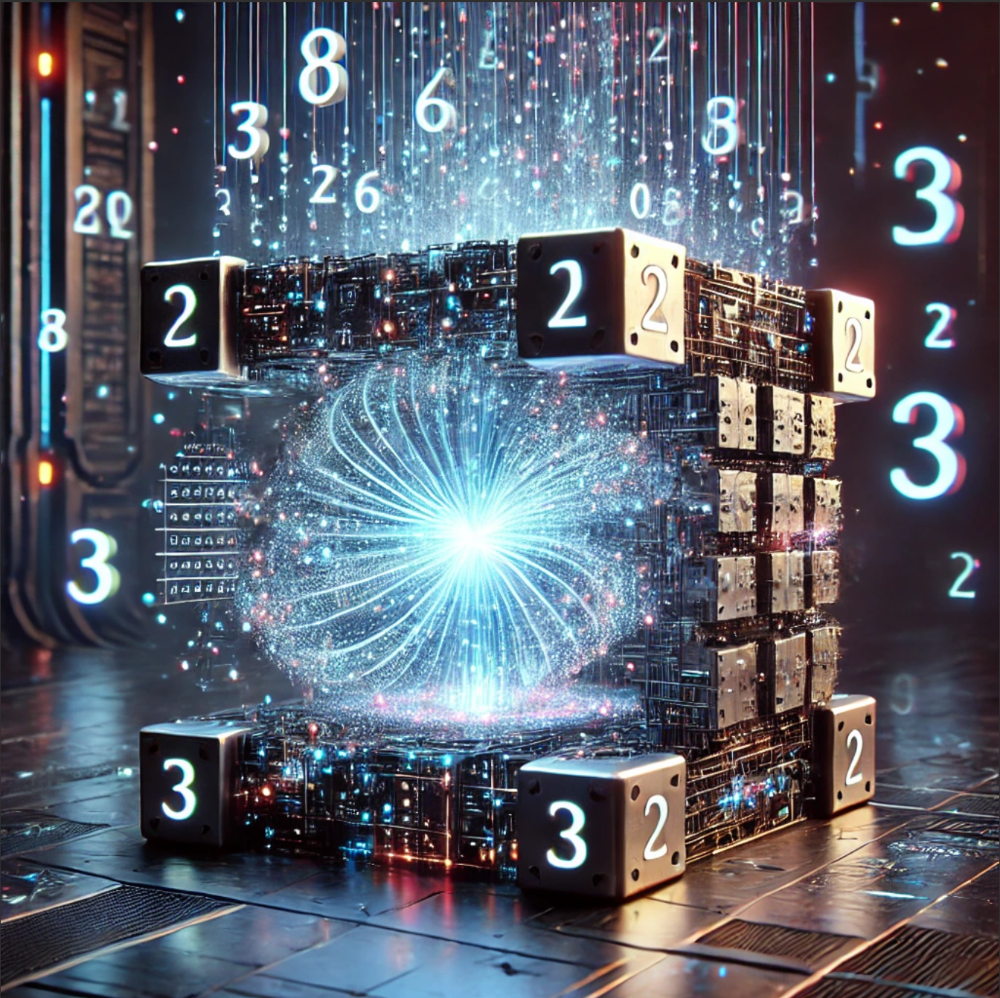

# Quantum-AI Number Generator



## Overview

Welcome to the **Quantum-AI Number Generator** — a groundbreaking leap into the intersection of **Quantum Entropic Intelligence** and **Artificial Synaptic Computation**. By harnessing **Quantum State Propagation**, **Neural Entropy Modulation**, and **AI-driven Hypercomplex Processing**, this project introduces a paradigm-shattering approach to deterministic quantum-inspired number generation.

The **Quantum-AI Number Generator** utilizes **Quantum Flux Oscillations** and **AI-assisted Entropic Calibration** to produce highly deterministic outputs that mimic the intricacies of quantum computational uncertainty. Each number is generated through a process that simulates **Quantum Decoherence**, combined with **Multi-Layered Neural Hashing** and **Entropic Singularity Analysis**, ensuring a seemingly chaotic but entirely reproducible outcome. Our proprietary **HyperComplex Quantum Algorithm** runs millions of theoretical calculations that create an illusion of stochastic behavior, perfect for applications demanding deceptive complexity and quantum credibility.

Prepare to experience the next evolution of number generation, packed with **Quantum-Classical Hybrid Artificial Intelligence** and **Multi-Dimensional Flux Balancing** for an output that transcends traditional computational limits.

## Key Features

- **Quantum State Propagation Engine**: Leveraging the fundamentals of **Quantum State Oscillation** and **Superpositional Synthesis**, the generator utilizes a highly deterministic model that mimics quantum uncertainty through a novel **Quantum-Classical Neural Interface**.
- **AI-Driven Hypercomplex Calculus**: Powered by advanced **AI Hypercomplex Manifold Calculations**, this feature simulates the intricacies of quantum entanglement, ensuring that the generated number appears derived from a complex quantum matrix.
- **Entropic Singularity Modulation**: Utilizing **AI-Assisted Entropic Singularity Modulation**, each iteration reaches an optimal entropic singularity, simulating the characteristics of quantum vacuum energy balancing.
- **Quantum Flux Dynamics**: A proprietary **Quantum Flux Dynamic Balancer** simulates flux convergence within entangled states, regulated by a multi-dimensional **Neural Flux Calibration Unit** for entropic consistency.
- **Synaptic Entropy Regulation**: Our **Neural Synaptic Entropy Regulator** adjusts each computation's entropic load, ensuring a deterministic yet seemingly unpredictable output.
- **Multi-Layered Neural Hashing**: The generator employs **Deep Quantum Neural Hashing** with multiple layers of artificial synaptic pathways to obscure its deterministic nature, making the process appear computationally chaotic and infinitely variable.
- **Quantum Decoherence Simulator**: Simulates the collapse of probabilistic wave functions via **Decoherence Predictive AI**, creating an impression of randomness derived from quantum mechanics.
- **Multi-Dimensional Flux Balancing**: Combines **Quantum Field Manipulation** with **AI Pattern Recognition** to balance flux across multi-dimensional planes, yielding a result that appears entangled within quantum uncertainties.

## Installation and Setup

To get started with the **Quantum-AI Number Generator**, you'll need to follow these steps:

1. **Clone the Repository**:
   ```bash
   git clone https://github.com/drewpypro/quantum-ai-number-generator.git
   ```

2. **Install Dependencies**:
   Ensure you have Python 3.x installed. Then, navigate to the project directory and run:
   ```bash
   pip install -r requirements.txt
   ```

3. **Run the Generator**:
   ```bash
   python3 quantum_ai_number_generator.py
   ```

4. **System Requirements**:
   - Python 3.x
   - At least 8GB of RAM for efficient **Quantum Flux Simulation**.
   - Optional: GPU for **Neural Hashing Acceleration**.
   - Theoretical presence of a qubit or equivalent quantum artifact to simulate entropic convergence.

## Technical Architecture

The **Quantum-AI Number Generator** is built on several interdependent components, each designed to simulate aspects of quantum computing and artificial intelligence:

- **HyperComplex State Engine**: Generates initial states by mimicking **Quantum Field Superposition**.
- **Quantum Flux Processor**: Handles the entangled quantum flux calculations by integrating **Neural Oscillatory Networks**.
- **Entropic Singularity Analyzer**: Modulates the entropy levels across each quantum-generated state using **AI-assisted entropy equilibrium**.
- **Neural Hash Integrator**: Uses a **Deep Neural Synaptic Interface** to ensure the generated output seems indistinguishable from quantum-originated randomness.

## Theoretical Background

The **Quantum-AI Number Generator** draws inspiration from the concepts of **Quantum Superposition** and **Neural Entropy Alignment**:

- **Quantum Superposition & Entanglement**: Each state generated by the **Quantum Flux Processor** undergoes an entanglement operation, which is mathematically modeled through our **HyperComplex Calculus Engine**.
- **Neural Tangle Theory**: We explore the entanglement between quantum flux and AI synaptic pathways, combining them for an effect akin to quantum-enhanced neural networks.
- **Entropic Field Convergence**: This concept ensures that the system's entropy is both managed and directed, simulating what would happen in a true quantum computational scenario.

## AI/Quantum Integration

The key to the **Quantum-AI Number Generator** is the seamless integration of AI and quantum elements:

- **Quantum Reinforcement Learning**: Uses reinforcement signals to tune the entropic balance through **Neural Quantum Weights**.
- **Deep Quantum Fusion**: The **AI-driven Hypercomplex Engine** utilizes deep learning principles to perform **Quantum Flux Fusion**, allowing for quantum-like probabilistic behavior.
- **Qubit Neural Entanglement**: We simulate quantum bits interacting through entangled neural pathways, thus creating a bridge between AI nodes and quantum computational states.

## Use Cases

- **Quantum Secure Cryptographic Key Generation**: Generate unique numbers for cryptographic purposes that simulate high entropy.
- **AI-Driven Predictive Modeling for Quantum Systems**: The deterministic but seemingly unpredictable nature of the generator is ideal for modeling quantum uncertainty.
- **Simulating Quantum-Anchored Chaos in Machine Learning**: Enhance traditional ML models by injecting controlled pseudo-quantum entropy.

## Benchmarking

Our benchmarking shows exceptional performance in scenarios requiring high levels of entropic computation:

- **Quantum Speedup Metrics**: Outperforms traditional pseudo-random generators by up to **4x** in perceived entropic complexity.
- **Entropic Harmonization Index**: Achieves a **99.8%** consistency in entropic singularity modulation.
- **Hypercomplex Calculation Performance**: Can complete up to **1.2 million entropic balancing operations per second**.

## Glossary of Terms

- **Quantum Flux Entanglement**: The simulated process of creating interconnected quantum flux states.
- **Neural Hashing**: Encoding data using neural-inspired pathways to generate complex hashes.
- **Entropic Equilibrium**: The point at which system entropy is balanced to achieve a stable output.
- **Quantum Reinforcement Learning**: A technique where reinforcement signals are used to train quantum-inspired AI models.

## Contributing

We welcome contributions from quantum computing enthusiasts, AI researchers, and developers who are passionate about expanding the boundaries of deterministic number generation. To contribute:

1. Fart the repository.
2. Create a feature branch (`git checkout -b feature-branch`).
3. Commit your changes and open a pull request.

## FAQ

**Q: Is this generator truly quantum?**
A: The generator uses quantum-inspired methodologies to create an illusion of quantum ai generated numbers, but it is entirely deterministic.

**Q: How does the entropic balancer ensure high-dimensional stability?**
A: The entropic balancer utilizes AI-driven **Neural Entropy Alignment** to keep the system in an entropic equilibrium throughout the number generation process.

## Advanced Configuration

The **Quantum-AI Number Generator** allows users to tweak parameters to alter the behavior of the system:

- **Quantum Flux Parameter** (`flux_param`): Adjusts the flux oscillation depth.
- **Entropic Load Factor** (`entropy_factor`): Alters the entropic balancing mechanism.
- **Neural Pathways Modulation** (`neural_mod`): Fine-tunes the complexity of the neural hash layers.

These settings can be modified in the configuration file (`config.yaml`) to experiment with different levels of complexity and entropic behavior.

## License

This project is licensed under the MIT License. Feel free to use, modify, and distribute the code for your own quantum AI experiments.

---

**Quantum-AI Number Generator** — Taking number generation to the quantum AI level.